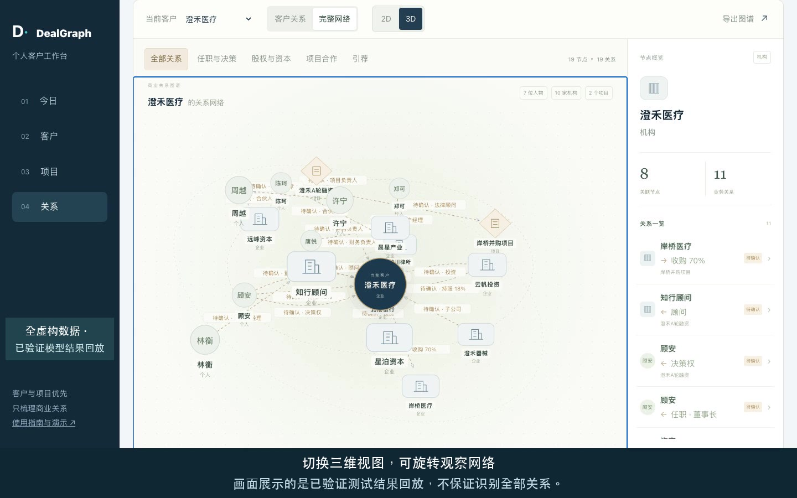

# DealGraph

精品投行的个人客户与项目工作台：把零散商业沟通整理成可用的关系图，知道该找谁、涉及哪个项目、下一步做什么。

**商业关系优先，不把聊天频率当成人脉价值。** 适用于融资顾问、并购顾问、客户覆盖与项目跟进；不是自动尽调结论、自动交易判断或团队云端 CRM。

[上传说明](docs/UPLOAD.zh-CN.md) · [部署说明](docs/DEPLOY.zh-CN.md) · [测试与边界](docs/TESTING.zh-CN.md)

## 用在哪些场景

- **会前梳理客户**：查任职、明确决策权、股东和投资方、顾问及已有商务引荐。
- **推进融资与并购**：按项目看参与方、负责人、法律顾问和引荐链路；区分历史、计划、否定与冲突。
- **会后持续跟进**：记录需求、约定和下一步，按今天、逾期、以后整理待办。
- **展示关系网络**：2D / 3D 共用关系数据，支持搜索、类型／状态／项目筛选、客户中心与完整网络、节点详情和导出；切换视图不调用模型，也不会增加关系。

首页有「今日 / 客户 / 项目 / 关系」四个入口。项目接洽状态由你填写，不会因为标记“已发材料”就自动生成投资关系。同群、频繁聊天、普通饭局介绍和私人饭钱不作为商业关系依据。

## 三分钟开始

要求 Node.js 24。取得符合 [LICENSE](LICENSE) 的使用授权后，在仓库根目录运行：

```sh
git clone https://github.com/yanlinc-hue/DealGraph.git
cd DealGraph
npm ci
npm run dev
```

打开 **http://127.0.0.1:5174**。先看虚构示范或新建空白工作台，不需要模型密钥。添加客户、项目、记录和待办都可以在本地完成。

```sh
npm test
npm run build
```

`npm run preview` 只预览静态构建，不提供模型 API；完整本地体验请用 `npm run dev`。本项目包含前端、后端、测试及演示资产的完整源码，不是只有网页编译产物。

## 导入商业聊天

点击「导入聊天」，按四步操作：

1. 选择授权取得的会话 JSON，限定日期，排除或编辑无关内容，检查实际待发送文本。
2. 输入自己的模型服务商 API 密钥，第一次同意上传并发现商业节点。
3. 人工核对人物、机构、项目和同名身份，必要时合并或补充名单。
4. 第二次同意上传确认名单与文本，解析关系。两个阶段分别计费。

目前支持本项目定义的单会话 JSON v1；**不是微信官方导出格式，不读取微信或 iPhone 备份**。已有其他授权导出文件的用户，需要先按[字段规范](docs/UPLOAD.zh-CN.md#文件格式)转换。图片、语音、文件及分享卡片暂不解析。

导入成功会新增独立资料集，旧记录保留；同名对象不会跨资料集自动合并。模型可能漏节点或关系，名单确认不是可跳过的形式步骤。

## 模型与隐私

页面支持 OpenAI、DeepSeek、通义千问和 Kimi 的已配置模型，默认 GPT-4o。使用自己的对应服务商 API 密钥（BYOK），不共享站长额度，也不在服务器配置公共模型 key。

选择文件先在浏览器处理；只有明确同意后，预览文本和必要名单才经本机服务或部署站点的 Worker 发给所选服务商。**本地运行不等于云模型不出网。** 线上经过 Cloudflare，选择国内模型也不代表全链路只在境内。服务商数据政策请在连接页面查看。

密钥临时保留在当前页面，30 分钟、切换模型、移除或关闭导入后清除，不写进工作台。普通笔记和待办不随模型分析自动上传。辅助隐藏号码和标识不保证完全匿名，日常正文如未排除，仍可能被上传。

## 加密保存与恢复

工作台不是自动保存。修改后点击「加密保存」，设置 **12–256 字符**密码，下载 `.dgvault` 并确认找到文件；刷新或关闭会丢失未保存内容。下次用「打开文件」解密并确认恢复。

浏览器使用 AES-256-GCM 与 PBKDF2-SHA256 加密，包含资料集、分析文本、关系快照、记录和待办，不含 API 密钥、密码或上传授权。密码丢失无法找回。文件加密不保护已解锁页面、恶意插件或被控制的设备，不代表经过独立密码学审计。

## 中文演示与虚构示例

[](public/demo/dealgraph-demo-zh.mp4)

[103 秒演示视频](public/demo/dealgraph-demo-zh.mp4) · [中文字幕](public/demo/dealgraph-demo-zh.srt) · [73 条虚构聊天](public/examples/wechat-noisy.synthetic.json) · [加密工作台示例](public/examples/demo-workbench.dgvault)

示例文件的公开密码是 `Demo2026!Graph`，**仅用于全虚构数据，绝不能用于客户资料**。示例工作台用「打开文件」，聊天 JSON 用「导入聊天」。复现实测时把截止日期设为 2026-09-09，保留完整否定和更正上下文。视频压缩了人工核对过程，不代表全自动一次完成。

## 部署自己的站点

采用 **一个 Cloudflare Worker 同时提供静态网页与模型 API**，通过 `ASSETS` 绑定加载 `dist/`，不需要另建静态站点或转发到第三方产品域名。

先按[部署说明](docs/DEPLOY.zh-CN.md)将 `wrangler.jsonc` 的 `APP_ORIGIN` 手工设置为你自己的实际 HTTPS 网址，确认 Cloudflare 授权，再运行：

```sh
npm run build
npm run deploy
```

前后端必须同源，不能保留示例域名或添加任意来源通配。部署成功、接口可用和真实模型分析成功是不同验收项目；不要只看首页能打开。

## 测试边界与许可

独立迁移版已通过 156 项离线测试、图谱渲染、lint、构建和隔离运行检查。历史 GPT-4o 虚构样本中，原样本明确关系命中 18/19，新样本 15/15；新样本人工补了两个机构，角色字段和更正仍未满分。这不是完全自动或总体准确率 100%，见[计分口径](docs/TESTING.zh-CN.md)。新域名的上线与浏览器验收需单独记录。

获得源码不等于 MIT 或其他开源授权。项目采用专有许可，使用、修改、部署及分发以 [LICENSE](LICENSE) 为准；第三方组件的权利和声明单列于 [THIRD_PARTY_NOTICES.md](THIRD_PARTY_NOTICES.md)。不要提交客户文件、原始评测响应、日志、密钥或密码。
